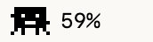

# tokenspender

A small native macOS menu-bar monitor for Claude, Codex and Kimi quota remaining.

<p>
  
  
</p>


| Eating | Dancing |
|---|---|
|  |  |

## Install

Requires macOS 14+ and Xcode Command Line Tools. No package dependencies.

```sh
git clone https://github.com/CharlesSOo/tokenspender.git
cd tokenspender
./install.sh
```

Builds, ad-hoc signs, installs to `~/Applications/tokenspender.app`, opens it and registers it as a login item. Source build, not notarized.

## Accounts

- **Claude:** sign in normally in Claude Code. If the row says **authorize in Settings**, choose **Settings → Authorize Claude Code access…** and approve the Keychain prompt once. Expired? Sign in again in Claude Code, then Refresh.
- **Claude, multiple accounts (optional):** install [claude-swap](https://github.com/realiti4/claude-swap) and save accounts with `cswap add`. See [integration notes](docs/account-selection.md).
- **Codex:** sign in through Codex CLI (`~/.codex/auth.json`).
- **Kimi:** sign in to `kimi-coding` in Pi (`~/.pi/agent/auth.json`).

Credentials are read-only; renew expired logins in their owning tool. Requests go directly to the providers. No backend, no telemetry.

## Display

The menu-bar number is one of:

- **Available now:** mean of each account's limiting remaining percentage.
- **Lowest account:** the lowest remaining quota.
- **Claude pool / Codex pool:** one provider's estimate.
- **Pinned Claude account:** one account's limiting window.

These aggregates are estimates, not a shared token balance: accounts are weighted equally and a weekly limit can bind even when the five-hour window has room. Exact per-account bars and both reset times stay visible in the popover.

Animation (Off, Eating, Legs, Legs + arms, Legs + arms + eating) reacts to session-log file activity, a proxy for work rather than measured token spend.

## Development

Pure AppKit, ~450 KiB bundle, ~20 MiB settled footprint. `swift test` runs the tests. Regenerate demo images with `TOKENSPENDER_DEMO=1 TOKENSPENDER_SNAPSHOT_DIR="$PWD/docs" .build/release/TokenSpender` after a release build.

MIT licensed. Provider parsing includes code adapted from [CodexBar](https://github.com/steipete/CodexBar); see [THIRD_PARTY_NOTICES.md](THIRD_PARTY_NOTICES.md). Not affiliated with Anthropic, OpenAI or Moonshot AI.
