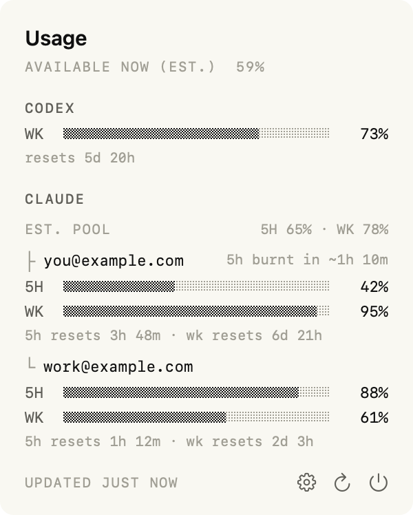
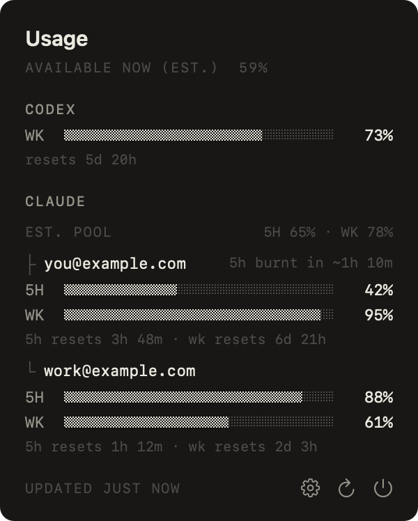
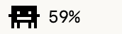

# tokenspender

A small native macOS menu-bar monitor for Claude, Codex and Kimi quota remaining.

<p>
  
  
</p>




## Install

Requires macOS 14+, Swift 5.9+ and Xcode Command Line Tools. No Swift package dependencies.

```sh
git clone https://github.com/CharlesSOo/tokenspender.git
cd tokenspender
./install.sh
```

Builds for your Mac, ad-hoc signs, installs to `~/Applications/tokenspender.app`, and opens it. The app registers for launch at login; manage this in System Settings → General → Login Items. This is a source build, not a notarized download.

## Accounts

- **Claude:** install [claude-swap](https://github.com/realiti4/claude-swap), save accounts with `cswap add`, and ensure `cswap list --json` works. Accounts are discovered dynamically. claude-swap manages and may refresh its own credentials.
- **Codex:** sign in through Codex CLI. Reads `~/.codex/auth.json`; a Pi OpenAI login is not interchangeable with this ChatGPT usage credential.
- **Kimi:** sign in to `kimi-coding` in Pi. Reads `~/.pi/agent/auth.json`. Missing credentials hide the provider; expired or unreadable configured credentials show an error.

Direct Codex/Kimi credentials are read-only: renew expired logins in their owning tool. Usage requests go directly to the providers; there is no tokenspender backend or telemetry. CodexBar is not required.

## Display

- **Available now:** estimated mean of each available account's limiting remaining percentage.
- **Lowest account:** the lowest remaining quota.
- **Claude pool / Codex pool:** the corresponding provider's estimated remaining percentage.

**These aggregates are estimates, not a shared token balance.** Providers do not expose comparable token capacities; accounts are weighted equally, not by invented plan multipliers. A weekly limit can constrain an account even when its five-hour window has room. Exact per-account bars remain visible.

Both window reset times appear below the bars. Consumption ETA needs at least 15 minutes of fresh declining observations and restarts after relaunch/reset; it is an estimate, not a guarantee.

System appearance controls light/dark mode. Animation settings: Off, Eating (default), Legs, Legs + arms, or Legs + arms + eating. Animation responds to session-log filesystem activity, **a proxy for work—not verified token spending**. Off stops the watcher. No token-total scanning.

## Resource measurements

One Apple Silicon release build, short refresh/open-close test; not a long-duration leak guarantee:

| Measurement | Observed |
|---|---:|
| App bundle | 384 KiB |
| Physical footprint, settled | 20.4–20.8 MiB |
| Physical footprint, observed peak | 22.9 MiB |
| Resident memory (RSS), sampled peak | ~69.7 MiB |
| Idle CPU | 0.0% |
| Separate claude-swap helper footprint | ~23.8 MiB during refresh |

RSS and physical footprint are different metrics. Helper memory is additional; total refresh memory is **not** under 30 MiB. Pure AppKit; no SwiftUI runtime.

Run tests with `swift test`. Regenerate privacy-safe demo images with `TOKENSPENDER_DEMO=1 TOKENSPENDER_SNAPSHOT_DIR="$PWD/docs" .build/release/TokenSpender` after a release build.

MIT licensed. Provider parsing includes code adapted from [CodexBar](https://github.com/steipete/CodexBar); see [THIRD_PARTY_NOTICES.md](THIRD_PARTY_NOTICES.md). Independent project, not affiliated with Anthropic, OpenAI or Moonshot AI.
